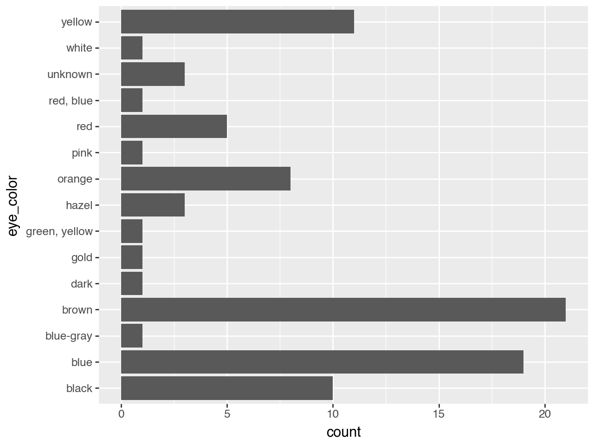
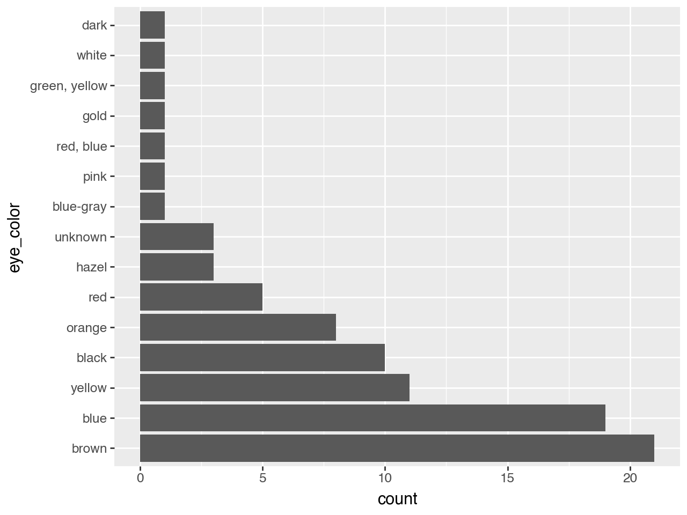

# catfact


Categorical wrangling for Python. Supports both Polars and Pandas.
Enables categorical and ordinal scales in plotting tools like Plotnine.

catfact addresses some common challenges when working categorical data.
Categorical data is useful when you want to display your data in a
specific way, like alphabetical, most frequent first, or along a scale.
It is a port of the popular R package forcats.

## Installation

``` bash
pip install catfact
```

## Basic example

``` python
import polars as pl
import catfact as fct
from catfact.polars.data import starwars

starwars.group_by("eye_color").count().sort("count", descending=True)
```

    /var/folders/r4/5821nk2d3nv2q7vr8v6gg5f00000gn/T/ipykernel_52691/3587020825.py:5: DeprecationWarning: `GroupBy.count` was renamed; use `GroupBy.len` instead

<div><style>
.dataframe > thead > tr,
.dataframe > tbody > tr {
  text-align: right;
  white-space: pre-wrap;
}
</style>
<small>shape: (15, 2)</small>

| eye_color       | count |
|-----------------|-------|
| str             | u32   |
| "brown"         | 21    |
| "blue"          | 19    |
| "yellow"        | 11    |
| "black"         | 10    |
| "orange"        | 8     |
| …               | …     |
| "green, yellow" | 1     |
| "pink"          | 1     |
| "white"         | 1     |
| "blue-gray"     | 1     |
| "gold"          | 1     |

</div>

``` python
from plotnine import ggplot, aes, geom_bar, coord_flip

(
    ggplot(starwars, aes("eye_color"))
    + geom_bar()
    + coord_flip()
)
```



``` python
(
    starwars.with_columns(fct.infreq(pl.col("eye_color")))
    >> ggplot(aes("eye_color"))
    + geom_bar()
    + coord_flip()
)
```


